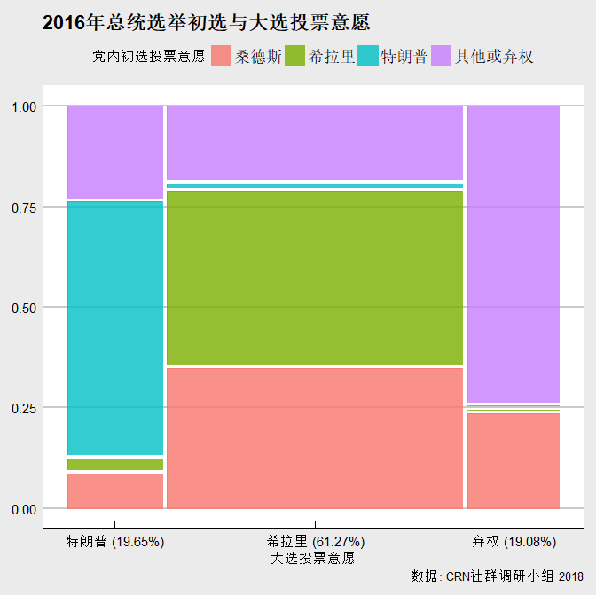
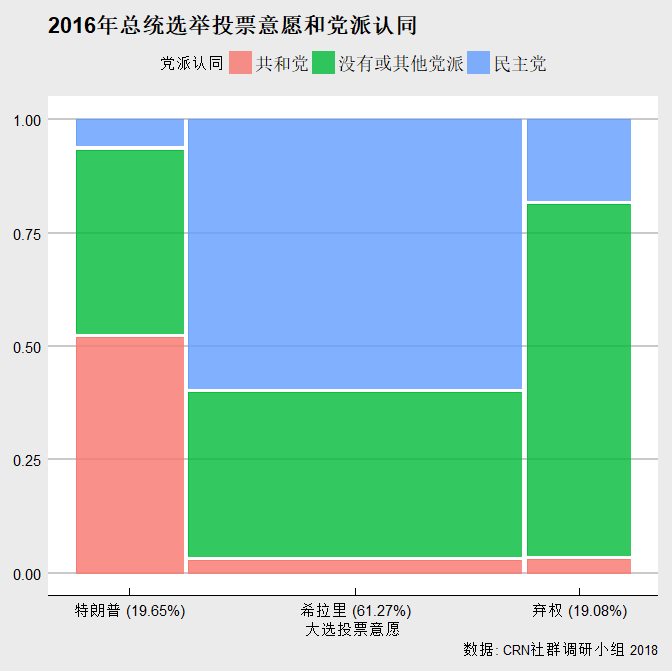
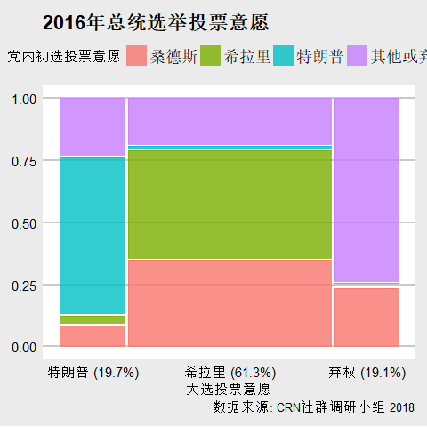

北美华人性少数社区政治倾向报告
================
华人彩虹联盟（CRN）社群调研小组 好汉 邵帅 Mario
2018年3月

主要发现
--------

2016年大选的选择: 为什么性少数投票给特朗普？
--------------------------------------------

政策偏向
--------

    ##  [1] 0.19225585 0.17480660 0.11004204 0.08850612 0.07277833 0.07038424
    ##  [7] 0.05863181 0.05473648 0.05012866 0.04568559 0.03928774 0.02930594
    ## [13] 0.01345060

    ##                              PC1   PC2   PC3   PC4   PC5
    ## redist_tax_high_income     -0.18  0.01 -0.62  0.13 -0.12
    ## redist_welfare             -0.35 -0.02 -0.43  0.10 -0.14
    ## redist_health_care          0.22  0.25 -0.33  0.30 -0.21
    ## order_security_priority     0.25 -0.27 -0.34  0.02  0.09
    ## patriotism                  0.30 -0.29 -0.29 -0.38  0.12
    ## patriotism_over_lgbt_right  0.36  0.01 -0.25 -0.28 -0.02
    ## abortion_limit              0.23 -0.33  0.02 -0.08 -0.29
    ## immigrant_illegal_deport    0.34  0.08  0.08  0.63  0.01
    ## immigrant_legal_control     0.26 -0.28  0.09  0.36 -0.34
    ## gun_control                 0.04 -0.22 -0.11  0.29  0.83
    ## marijuana_legal            -0.39  0.08 -0.15  0.13 -0.01
    ## aa_race                    -0.25 -0.52  0.10  0.04 -0.09
    ## aa_gender                  -0.23 -0.52  0.05  0.15 -0.09

政治信息获取
------------

身份认同
--------

样本构成
--------

结语：少数群体中的少数派？
--------------------------

（两篇political science的研究）
