北美华人同志的身份政治
================
华人彩虹联盟（CRN）社群调研小组 好汉陈 邵帅 
2018年9月30日

-   [介绍](#介绍)
-   [我们是谁](#我们是谁)
    -   [身份认同](#身份认同)
    -   [同志社群](#同志社群)
    -   [同志社群参与和身份认同的关联](#同志社群参与和身份认同的关联)
-   [我们怎么参与政治](#我们怎么参与政治)
    -   [对政治的兴趣](#对政治的兴趣)
    -   [媒体使用](#媒体使用)
    -   [参与实践：志愿活动，游行抗议](#参与实践志愿活动游行抗议)
-   [我们支持和反对什么](#我们支持和反对什么)
    -   [2016大选的选择](#大选的选择)
    -   [政策倾向](#政策倾向)
        -   [经济议题](#经济议题)
        -   [社会议题](#社会议题)
-   [同志身份认同和政治观点的关联](#同志身份认同和政治观点的关联)
-   [结语](#结语)

介绍
====

我们是谁
========

身份认同
--------
作为双重少数群体的华人LGBT，处在多种身份的交叉地带。
通过调查我们发现，CRN社区内部LGBT的身份属性是最强的，其次是中国，最后是美国。
对母国的认同度高于移民国家应该在初代移民中具有普遍性。但LGBT之于母国的认同之上的事实让我们看到性取向对人的影响之大。也让我们感受到建设性少数群体社区的重要性，CRN任重道远。
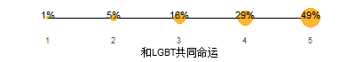

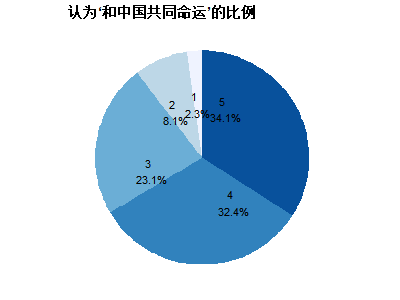

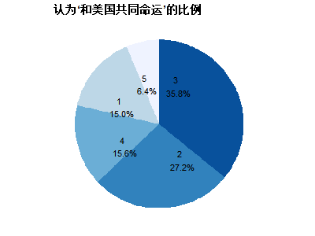

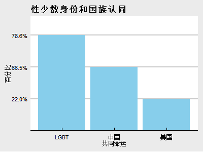

很有意思的发现：当LGBT权益和国家利益冲突的时候，CRN社区大多数人选择了国家利益，这倒是很有中国特色。

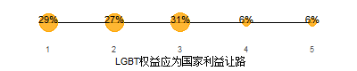

同志社群
--------
尽管83%的受调查者表示与当地的性少数群体有接触，但CRN社区成员大多还是把朋友圈建在了国人之间。为了社区的更好发展，我们得考虑如何将影响力拓展出去。

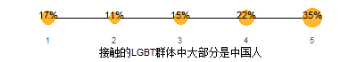

同志社群参与和身份认同的关联
----------------------------

我们怎么参与政治
================

对政治的兴趣
------------
尽管对美国的认同度不及中国，但是对美国政治的关心程度却大于中国。这真是一个非常务实的社群。^_^
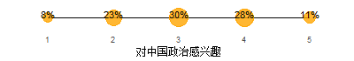

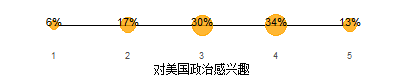

媒体使用
--------

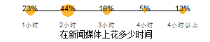

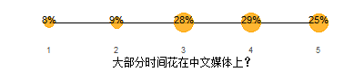

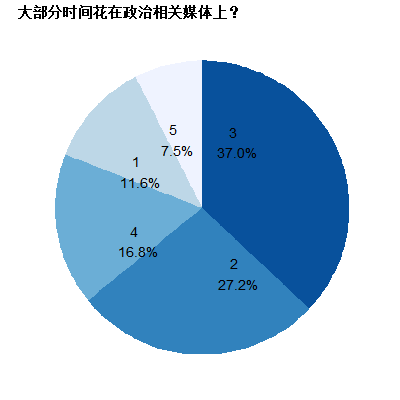

参与实践：志愿活动，游行抗议
----------------------------
非常遗憾的看到，社区朋友们对社区工作还是很冷淡的。这点应该是全体华人的通病，毕竟我们出生在一个由国家机器管理社区的社会里。但在这个国度，我们必须扭转思想，多多投生社区工作，因为这关系到我们每个人的切身利益。

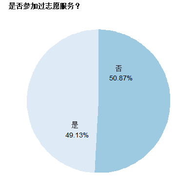

我们支持和反对什么
==================

2016大选的选择
--------------
我们社区在2016的大选中明显支持民主党。而且对桑德斯的支持度也也相当的高。总体偏左。

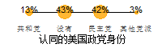

这里我们专门找到了NBC在大选前对美国LBGT所做的比较。可以看到，在表态的美国LGBT中，支持希拉里是支持特朗普的3.5倍，而在我们的社区内，这个数字是3。所以说，尽管我们的群体偏左，但和美国其他的LGBT比起来，我们更偏保守。在政治光谱中，我们夹在了偏左的LGBT和偏右的华人之间。对CRN管理者而言，如果未来对政治人物进行背书，必须非常的小心。

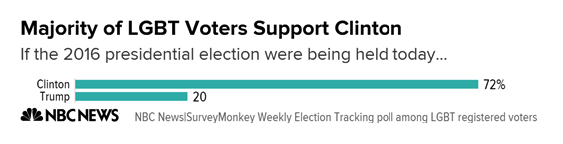

政策倾向
--------

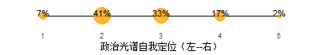

### 经济议题

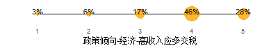

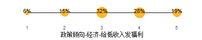

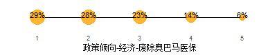

### 社会议题
非法移民，大麻，强制合法化等问题上，我们的社区的诉求和其他华人总体一致。。
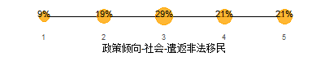

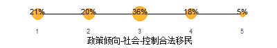

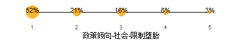

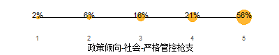

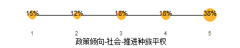

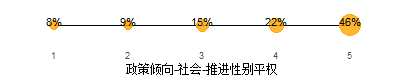

同志身份认同和政治观点的关联
============================

结语
====
