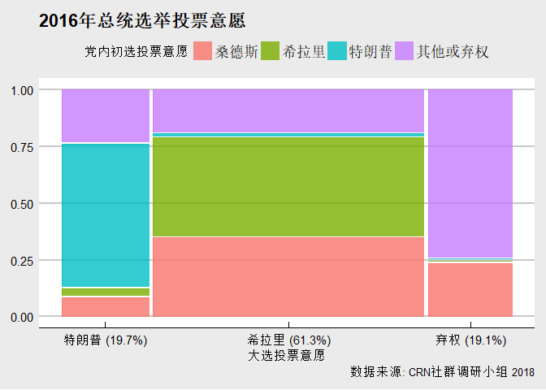

北美华人性少数社区政治倾向报告
================
华人彩虹联盟（CRN）社群调研小组 好汉 邵帅 Mario
2018年3月

主要发现
--------

2016年大选的选择: 为什么性少数投票给特朗普？
--------------------------------------------

    ## [1] "特朗普 (19.7%)" "希拉里 (61.3%)" "弃权 (19.1%)"

政策偏向
--------

身份认同
--------

样本构成
--------
