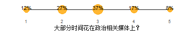
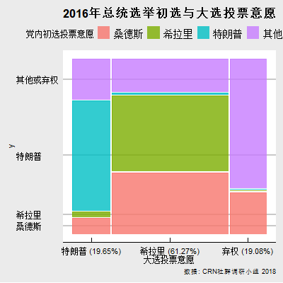
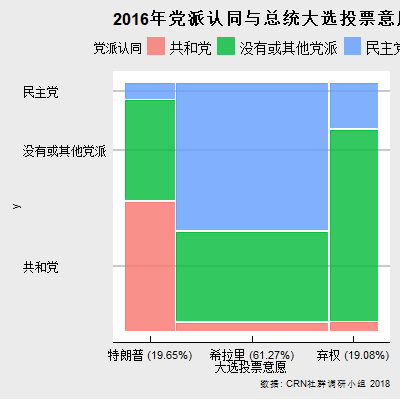

北美华人同志的身份政治
================
华人彩虹联盟（CRN）社群调研小组 好汉陈 邵帅
2018年9月30日

介绍
====

我们是谁
========

身份认同
--------

   

同志社群
--------

 

我们怎么参与政治
================

对政治的兴趣
------------

 

媒体使用
--------

 

参与实践：志愿活动，游行抗议
----------------------------

 

我们支持和反对什么
==================

 

同志身份认同和政治观点的关联
============================

结语
====
