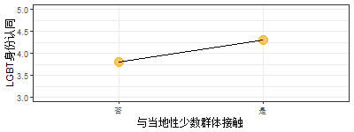
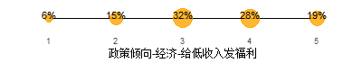
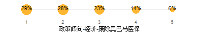
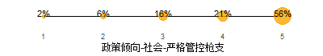
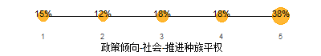

北美华人同志的身份政治
================
华人彩虹联盟（CRN）社群调研小组 好汉陈 邵帅 Mario
2018年9月30日

-   [介绍](#介绍)
-   [我们是谁](#我们是谁)
    -   [身份认同](#身份认同)
    -   [同志社群](#同志社群)
    -   [同志社群参与和身份认同的关联](#同志社群参与和身份认同的关联)
-   [我们怎么参与政治](#我们怎么参与政治)
    -   [对政治的兴趣](#对政治的兴趣)
    -   [媒体使用](#媒体使用)
    -   [参与实践：志愿活动，游行抗议](#参与实践志愿活动游行抗议)
-   [我们支持和反对什么](#我们支持和反对什么)
    -   [2016大选的选择](#大选的选择)
    -   [政策倾向](#政策倾向)
        -   [经济议题](#经济议题)
        -   [社会议题](#社会议题)
-   [同志身份认同和政治观点的关联](#同志身份认同和政治观点的关联)
-   [结语](#结语)

介绍
====

我们是谁
========

身份认同
--------

同志社群
--------

同志社群参与和身份认同的关联
----------------------------

我们怎么参与政治
================

对政治的兴趣
------------

媒体使用
--------

参与实践：志愿活动，游行抗议
----------------------------

我们支持和反对什么
==================

2016大选的选择
--------------

政策倾向
--------

### 经济议题

### 社会议题

同志身份认同和政治观点的关联
============================

结语
====
