CRN北美性少数政治倾向调查问卷
================

样本人群个人信息总结
--------------------

### 受访者地图

受访者的现居住地分布比较两极化。纽约和加州是这次受访者的主要居住地。其中23.6%的人居住在加州，22.54%的受访者居住在纽约州。加起来已经接近总人数的一半。中部有许多州没有样本。绝大部分的受访者居住在美国。但也有共六位来自加拿大的卑诗省和魁北克。

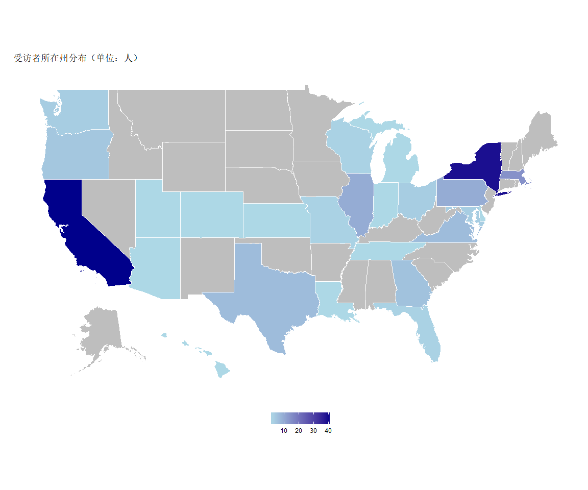

受访者的家乡（出生地）分布比较均匀，覆盖了中国大陆除新疆、西藏、宁夏之外的所有省份。其中来自福建、广东、江苏、湖北的受访者最多。中国大陆以外，此次问卷也有台湾、香港、澳门、新加坡的朋友参与。 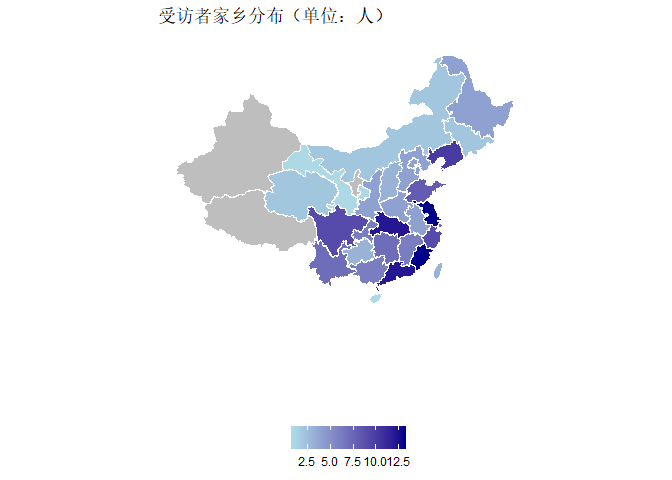

年龄和在北美居住的年限
----------------------

受访者的平均年龄大概是29岁，最年轻的受访者19岁，而最大的几位受访者的年龄在47岁以上。受访者平均在北美居住了六年，其中最少的今年刚到，最多以为的已经居住了27年以上。受访人平均到达北美的约为22岁，而且绝大部分都在20-30岁之间到达北美。这几项的分布都非常好，说明我们的样本质量好，能据此做出一些让人信服的推断。

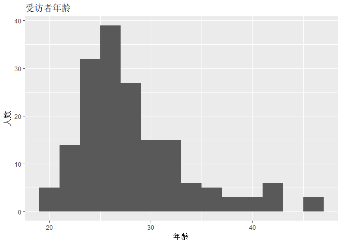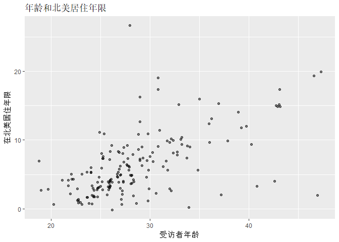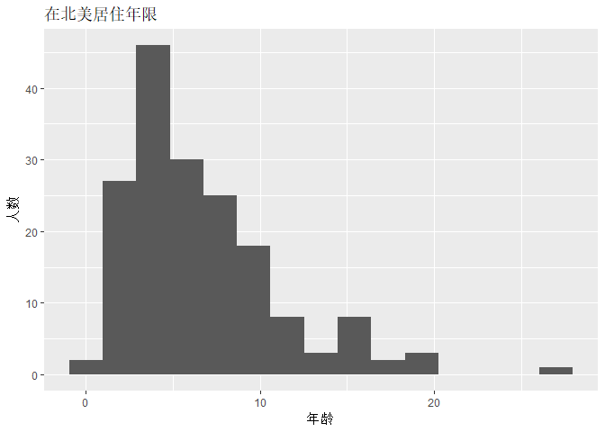

性别和性取向
------------

大约九成的受访者的生理与心理性别一致（即我们所说的“顺性别”者）。而8%的受访者认为自己的心理性别既是男性也是女性。在性取向方面，约九成受访者心理性别为男性、性取向为男性（即LGBT中的G）。

情感、婚姻、生育
----------------

受访者中单身和非单身的人群大概对半分，并且有接近两成的受访者已经结婚。同时，大概有37%的受访者目前没有小孩，但有要小孩的打算。对比处于不同情感婚姻状态之中的受访者，非单身的受访者的生育意愿显然更强。

教育
----

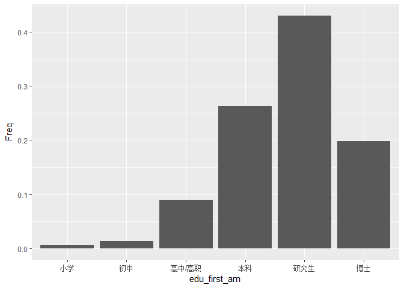

收入
----

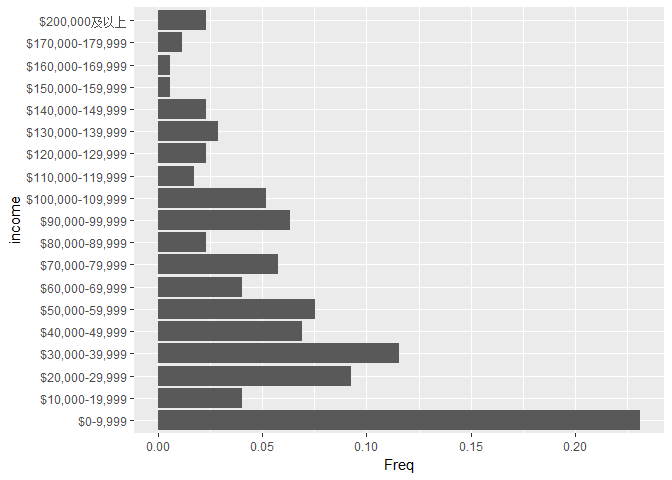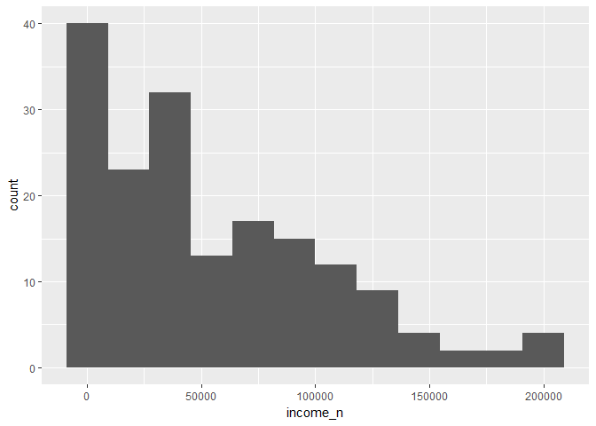

政治观点
========

关心政治的程度
--------------

党派认同，候选人支持
--------------------

比起关心中国政治，更多人关心美国政治。党派身份认同。中间选民比例最大，民主党次之，共和党最少。其中，STEM专业的人有更多的共和党支持者。学生中较少共和党支持者。有关对2016年大选候选人的支持：初选的桑德斯支持者和希拉里支持者一样多，大约三成。紧接着是川普，拿到了13%的支持。大选时希拉里的支持率有六成，川普两成，而有两成的人选择不投票（不管是初选还是大选，弃权率都是比较高的。大概都有两成的人)。大选弃权的（这两成）人是谁呢？我们可以看到大概两成多是首轮支持桑德斯的人，七成是首轮就不投票的人。。对党候选人和大选候选人的支持度有什么关系呢？首轮桑德斯支持者中只有78%在大选会投给希拉里，有16%会弃权， 6%会投给希拉里。大选弃权的（这两成）人是谁呢？我们可以看到大概两成多是首轮支持桑德斯的人，七成是首轮就不投票的人。自我认同为共和党的人中有14%会投给希拉里。而自我认同民主党人仅有3%会投给川普。自我认同无党派的人有接近一半会投给希拉里、接近两成投给川普。弃权的人大部分来自没有党派认同的人。

这些发现既和2016年大选的总体趋势一致，也带有LGBT群体的鲜明特征。首先，桑德斯作为在政治倾向上对LGBT群体最友好，以及在其他政治议题上最liberal的候选人，得到LGBT群体的支持非常正常。第二，桑德斯被淘汰出局后，一部分人并不会转投希拉里，而是选择了弃权甚至支持川普。第三，此次大选的候选人普遍黑点比较多，支持率不高，于是选择弃权的人也较多（占了两成）。第三，在我们LGBT群体内部，STEM专业人士中更多人支持川普，这大概是因为川普的的政策对这些行业的从业者有利。而学生更大比例支持民主党，于高校偏liberal的意识形态有关。

    ## 
    ##  
    ##    Cell Contents
    ## |-------------------------|
    ## |                       N |
    ## | Chi-square contribution |
    ## |           N / Row Total |
    ## |           N / Col Total |
    ## |         N / Table Total |
    ## |-------------------------|
    ## 
    ##  
    ## Total Observations in Table:  173 
    ## 
    ##  
    ##                | vote_gen16 
    ## vote_primary16 |     Trump |   Clinton |    不投票 | Row Total | 
    ## ---------------|-----------|-----------|-----------|-----------|
    ##        Sanders |         3 |        38 |         8 |        49 | 
    ##                |     4.565 |     2.119 |     0.194 |           | 
    ##                |     0.061 |     0.776 |     0.163 |     0.283 | 
    ##                |     0.088 |     0.358 |     0.242 |           | 
    ##                |     0.017 |     0.220 |     0.046 |           | 
    ## ---------------|-----------|-----------|-----------|-----------|
    ##        Clinton |         1 |        47 |         0 |        48 | 
    ##                |     7.540 |    10.520 |     9.156 |           | 
    ##                |     0.021 |     0.979 |     0.000 |     0.277 | 
    ##                |     0.029 |     0.443 |     0.000 |           | 
    ##                |     0.006 |     0.272 |     0.000 |           | 
    ## ---------------|-----------|-----------|-----------|-----------|
    ##          Trump |        22 |         1 |         0 |        23 | 
    ##                |    67.594 |    12.163 |     4.387 |           | 
    ##                |     0.957 |     0.043 |     0.000 |     0.133 | 
    ##                |     0.647 |     0.009 |     0.000 |           | 
    ##                |     0.127 |     0.006 |     0.000 |           | 
    ## ---------------|-----------|-----------|-----------|-----------|
    ##         Kasich |         2 |         0 |         1 |         3 | 
    ##                |     3.374 |     1.838 |     0.320 |           | 
    ##                |     0.667 |     0.000 |     0.333 |     0.017 | 
    ##                |     0.059 |     0.000 |     0.030 |           | 
    ##                |     0.012 |     0.000 |     0.006 |           | 
    ## ---------------|-----------|-----------|-----------|-----------|
    ##          Rubio |         1 |         0 |         0 |         1 | 
    ##                |     3.285 |     0.613 |     0.191 |           | 
    ##                |     1.000 |     0.000 |     0.000 |     0.006 | 
    ##                |     0.029 |     0.000 |     0.000 |           | 
    ##                |     0.006 |     0.000 |     0.000 |           | 
    ## ---------------|-----------|-----------|-----------|-----------|
    ##           Cruz |         1 |         0 |         1 |         2 | 
    ##                |     0.937 |     1.225 |     1.003 |           | 
    ##                |     0.500 |     0.000 |     0.500 |     0.012 | 
    ##                |     0.029 |     0.000 |     0.030 |           | 
    ##                |     0.006 |     0.000 |     0.006 |           | 
    ## ---------------|-----------|-----------|-----------|-----------|
    ##         不投票 |         3 |        13 |        23 |        39 | 
    ##                |     2.839 |     4.968 |    32.548 |           | 
    ##                |     0.077 |     0.333 |     0.590 |     0.225 | 
    ##                |     0.088 |     0.123 |     0.697 |           | 
    ##                |     0.017 |     0.075 |     0.133 |           | 
    ## ---------------|-----------|-----------|-----------|-----------|
    ##           其他 |         1 |         7 |         0 |         8 | 
    ##                |     0.208 |     0.898 |     1.526 |           | 
    ##                |     0.125 |     0.875 |     0.000 |     0.046 | 
    ##                |     0.029 |     0.066 |     0.000 |           | 
    ##                |     0.006 |     0.040 |     0.000 |           | 
    ## ---------------|-----------|-----------|-----------|-----------|
    ##   Column Total |        34 |       106 |        33 |       173 | 
    ##                |     0.197 |     0.613 |     0.191 |           | 
    ## ---------------|-----------|-----------|-----------|-----------|
    ## 
    ## 

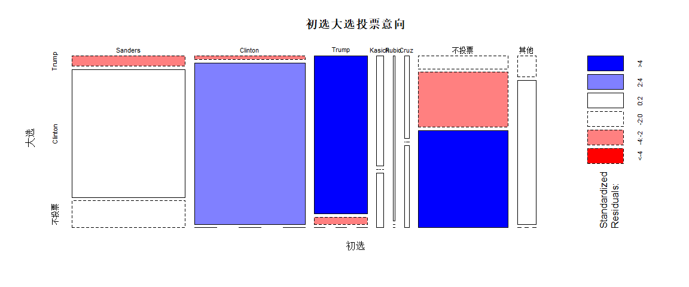

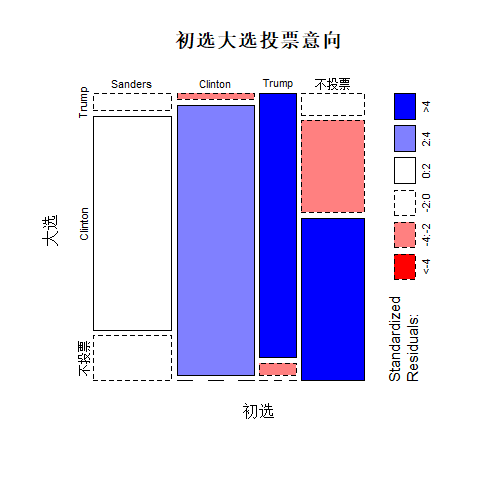

    ##                     vote_primary16 Sanders Clinton Trump Kasich Rubio Cruz 不投票 其他
    ## party_id vote_gen16                                                                   
    ## 共和党   Trump                           2       0    12      2     1    1      0    0
    ##          Clinton                         0       1     0      0     0    0      2    0
    ##          不投票                          0       0     0      0     0    1      0    0
    ## 没有     Trump                           1       0     9      0     0    0      3    1
    ##          Clinton                         2      18     1      0     0    0      9    4
    ##          不投票                          5       0     0      1     0    0     20    0
    ## 民主党   Trump                           0       1     1      0     0    0      0    0
    ##          Clinton                        33      27     0      0     0    0      2    2
    ##          不投票                          3       0     0      0     0    0      3    0
    ## 其他党派 Trump                           0       0     0      0     0    0      0    0
    ##          Clinton                         3       1     0      0     0    0      0    1
    ##          不投票                          0       0     0      0     0    0      0    0

    ## 
    ##  
    ##    Cell Contents
    ## |-------------------------|
    ## |                       N |
    ## |           N / Row Total |
    ## |           N / Col Total |
    ## |         N / Table Total |
    ## |-------------------------|
    ## 
    ##  
    ## Total Observations in Table:  173 
    ## 
    ##  
    ##              | vote_gen16 
    ##     party_id |     Trump |   Clinton |    不投票 | Row Total | 
    ## -------------|-----------|-----------|-----------|-----------|
    ##       共和党 |        18 |         3 |         1 |        22 | 
    ##              |     0.818 |     0.136 |     0.045 |     0.127 | 
    ##              |     0.529 |     0.028 |     0.030 |           | 
    ##              |     0.104 |     0.017 |     0.006 |           | 
    ## -------------|-----------|-----------|-----------|-----------|
    ##         没有 |        14 |        34 |        26 |        74 | 
    ##              |     0.189 |     0.459 |     0.351 |     0.428 | 
    ##              |     0.412 |     0.321 |     0.788 |           | 
    ##              |     0.081 |     0.197 |     0.150 |           | 
    ## -------------|-----------|-----------|-----------|-----------|
    ##       民主党 |         2 |        64 |         6 |        72 | 
    ##              |     0.028 |     0.889 |     0.083 |     0.416 | 
    ##              |     0.059 |     0.604 |     0.182 |           | 
    ##              |     0.012 |     0.370 |     0.035 |           | 
    ## -------------|-----------|-----------|-----------|-----------|
    ##     其他党派 |         0 |         5 |         0 |         5 | 
    ##              |     0.000 |     1.000 |     0.000 |     0.029 | 
    ##              |     0.000 |     0.047 |     0.000 |           | 
    ##              |     0.000 |     0.029 |     0.000 |           | 
    ## -------------|-----------|-----------|-----------|-----------|
    ## Column Total |        34 |       106 |        33 |       173 | 
    ##              |     0.197 |     0.613 |     0.191 |           | 
    ## -------------|-----------|-----------|-----------|-----------|
    ## 
    ## 

身份认同
--------

接近七成的人认为自己和中国在很大程度上具有共同命运，而只有大概两成的人认为自己和美国有共同命运。接近八成的人认为自己和性少数群体拥有共同命运。认为和中国有共同命运的人也大多认为自己和lgbt群体有共同的命运。有四分之一的人在两个维度上的打分都是5. 这背后的机制可能是有些人就比较爱群体吧。美国人的身份是被放在最后的。44%的人认为自己的性少数的身份先于中国人的身份，而28%的人认为自己中国的身份先于性少数身份。 那身份认同的排序是否让LGBT群体认为性少数群体的利益要为国家利益让路呢?是的。"性少数 &gt; 中国人 &gt; 美国人" 的倾向于不同意（接近七成的人倾向于不同意）。而"中国人 &gt; 性少数 &gt; 美国人"倾向于同意（接近一半的人对这个说法保持中立，两成倾向于同意）。

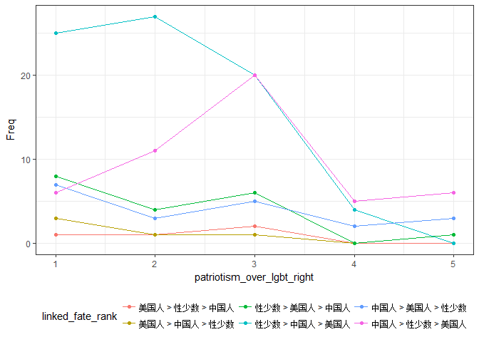

重要政策的态度
--------------

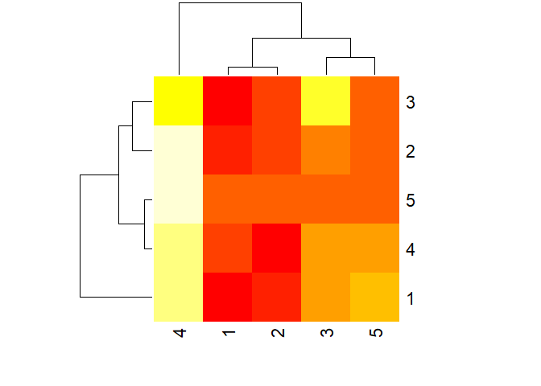
