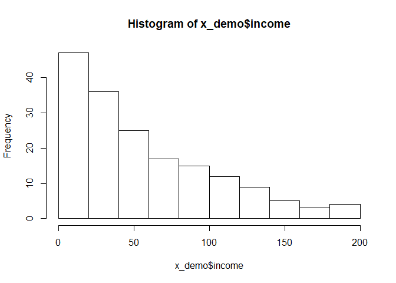
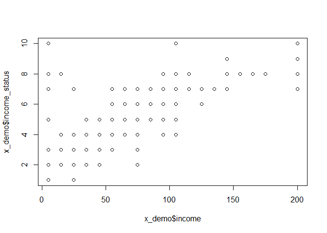
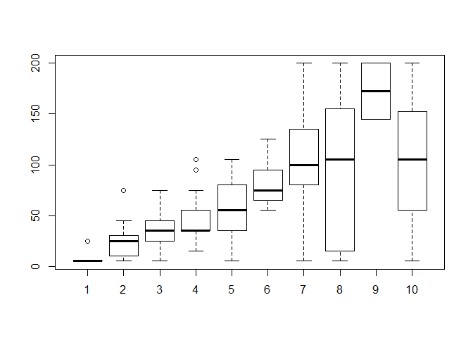

CRN Reserach
================
Haohan Chen

选举意向
--------

学生数量 58

    ##    sex_id_he        sex_id_she       sex_id_they      sex_orien_male  
    ##  Min.   :0.0000   Min.   :0.00000   Min.   :0.00000   Min.   :0.0000  
    ##  1st Qu.:1.0000   1st Qu.:0.00000   1st Qu.:0.00000   1st Qu.:1.0000  
    ##  Median :1.0000   Median :0.00000   Median :0.00000   Median :1.0000  
    ##  Mean   :0.8844   Mean   :0.02312   Mean   :0.09249   Mean   :0.9017  
    ##  3rd Qu.:1.0000   3rd Qu.:0.00000   3rd Qu.:0.00000   3rd Qu.:1.0000  
    ##  Max.   :1.0000   Max.   :1.00000   Max.   :1.00000   Max.   :1.0000  
    ##                                                                       
    ##  sex_orien_female  sex_orien_both         age            yr_am       
    ##  Min.   :0.00000   Min.   :0.00000   Min.   :19.00   Min.   : 0.000  
    ##  1st Qu.:0.00000   1st Qu.:0.00000   1st Qu.:25.00   1st Qu.: 3.000  
    ##  Median :0.00000   Median :0.00000   Median :27.00   Median : 5.000  
    ##  Mean   :0.05202   Mean   :0.04624   Mean   :28.71   Mean   : 6.318  
    ##  3rd Qu.:0.00000   3rd Qu.:0.00000   3rd Qu.:31.00   3rd Qu.: 8.000  
    ##  Max.   :1.00000   Max.   :1.00000   Max.   :47.00   Max.   :27.000  
    ##                                                                      
    ##   pob_prov_cn     pob_east          pob_ne           pob_west     
    ##  F福建省: 13   Min.   :0.0000   Min.   :0.00000   Min.   :0.0000  
    ##  J江苏省: 13   1st Qu.:0.0000   1st Qu.:0.00000   1st Qu.:0.0000  
    ##  G广东省: 12   Median :0.0000   Median :0.00000   Median :0.0000  
    ##  H湖北省: 12   Mean   :0.4335   Mean   :0.09249   Mean   :0.2312  
    ##  L辽宁省: 10   3rd Qu.:1.0000   3rd Qu.:0.00000   3rd Qu.:0.0000  
    ##  S四川省:  9   Max.   :1.0000   Max.   :1.00000   Max.   :1.0000  
    ##  (Other):104                                                      
    ##   pob_central                por       por_ny          por_ca       
    ##  Min.   :0.0000   California   :41   Mode :logical   Mode :logical  
    ##  1st Qu.:0.0000   New York     :39   FALSE:134       FALSE:132      
    ##  Median :0.0000   Massachusetts:14   TRUE :39        TRUE :41       
    ##  Mean   :0.2081   Illinois     : 9                                  
    ##  3rd Qu.:0.0000   Pennsylvania : 9                                  
    ##  Max.   :1.0000   New Jeresy   : 8                                  
    ##                   (Other)      :53                                  
    ##     stay_us      relation_single  relation_married  relation_ltr   
    ##  Min.   :1.000   Min.   :0.0000   Min.   :0.000    Min.   :0.0000  
    ##  1st Qu.:3.000   1st Qu.:0.0000   1st Qu.:0.000    1st Qu.:0.0000  
    ##  Median :4.000   Median :0.0000   Median :0.000    Median :0.0000  
    ##  Mean   :4.035   Mean   :0.4971   Mean   :0.185    Mean   :0.3006  
    ##  3rd Qu.:5.000   3rd Qu.:1.0000   3rd Qu.:0.000    3rd Qu.:1.0000  
    ##  Max.   :5.000   Max.   :1.0000   Max.   :1.000    Max.   :1.0000  
    ##                                                                    
    ##  relation_married_ltr    children        religious        citizen_v     
    ##  Min.   :0.0000       Min.   :0.0000   Min.   :0.0000   Min.   :0.0000  
    ##  1st Qu.:0.0000       1st Qu.:0.0000   1st Qu.:0.0000   1st Qu.:0.0000  
    ##  Median :0.0000       Median :0.0000   Median :0.0000   Median :1.0000  
    ##  Mean   :0.4855       Mean   :0.3931   Mean   :0.1965   Mean   :0.6763  
    ##  3rd Qu.:1.0000       3rd Qu.:1.0000   3rd Qu.:0.0000   3rd Qu.:1.0000  
    ##  Max.   :1.0000       Max.   :1.0000   Max.   :1.0000   Max.   :1.0000  
    ##                                                                         
    ##    citizen_gc       citizen_c           edu_hs           edu_ug      
    ##  Min.   :0.0000   Min.   :0.00000   Min.   :0.0000   Min.   :0.0000  
    ##  1st Qu.:0.0000   1st Qu.:0.00000   1st Qu.:0.0000   1st Qu.:0.0000  
    ##  Median :0.0000   Median :0.00000   Median :0.0000   Median :0.0000  
    ##  Mean   :0.2601   Mean   :0.06358   Mean   :0.0578   Mean   :0.2081  
    ##  3rd Qu.:1.0000   3rd Qu.:0.00000   3rd Qu.:0.0000   3rd Qu.:0.0000  
    ##  Max.   :1.0000   Max.   :1.00000   Max.   :1.0000   Max.   :1.0000  
    ##                                                                      
    ##    edu_master       edu_phd          edu_stem       edu_student    
    ##  Min.   :0.000   Min.   :0.0000   Min.   :0.0000   Min.   :0.0000  
    ##  1st Qu.:0.000   1st Qu.:0.0000   1st Qu.:0.0000   1st Qu.:0.0000  
    ##  Median :0.000   Median :0.0000   Median :1.0000   Median :0.0000  
    ##  Mean   :0.422   Mean   :0.3121   Mean   :0.6416   Mean   :0.3353  
    ##  3rd Qu.:1.000   3rd Qu.:1.0000   3rd Qu.:1.0000   3rd Qu.:1.0000  
    ##  Max.   :1.000   Max.   :1.0000   Max.   :1.0000   Max.   :1.0000  
    ##                                                                    
    ##  work_research     work_csds         work_fin       work_manage    
    ##  Min.   :0.000   Min.   :0.0000   Min.   :0.0000   Min.   :0.0000  
    ##  1st Qu.:0.000   1st Qu.:0.0000   1st Qu.:0.0000   1st Qu.:0.0000  
    ##  Median :0.000   Median :0.0000   Median :0.0000   Median :0.0000  
    ##  Mean   :0.237   Mean   :0.3642   Mean   :0.2023   Mean   :0.1734  
    ##  3rd Qu.:0.000   3rd Qu.:1.0000   3rd Qu.:0.0000   3rd Qu.:0.0000  
    ##  Max.   :1.000   Max.   :1.0000   Max.   :1.0000   Max.   :1.0000  
    ##                                                                    
    ##      income       income_status        vote_prim   vote_prim_s    
    ##  Min.   :  5.00   Min.   : 1.00   桑德斯    :49   Min.   :0.0000  
    ##  1st Qu.: 15.00   1st Qu.: 3.00   希拉里    :48   1st Qu.:0.0000  
    ##  Median : 45.00   Median : 4.00   特朗普    :23   Median :0.0000  
    ##  Mean   : 56.45   Mean   : 4.52   其他或弃权:53   Mean   :0.2832  
    ##  3rd Qu.: 95.00   3rd Qu.: 7.00                   3rd Qu.:1.0000  
    ##  Max.   :200.00   Max.   :10.00                   Max.   :1.0000  
    ##                                                                   
    ##   vote_prim_h      vote_prim_t      vote_prim_a   vote_gen  
    ##  Min.   :0.0000   Min.   :0.0000   Min.   :0    特朗普: 34  
    ##  1st Qu.:0.0000   1st Qu.:0.0000   1st Qu.:0    希拉里:106  
    ##  Median :0.0000   Median :0.0000   Median :0    弃权  : 33  
    ##  Mean   :0.2775   Mean   :0.1329   Mean   :0                
    ##  3rd Qu.:1.0000   3rd Qu.:0.0000   3rd Qu.:0                
    ##  Max.   :1.0000   Max.   :1.0000   Max.   :0                
    ##                                                             
    ##    vote_gen_t       vote_gen_h       vote_gen_a               party_id 
    ##  Min.   :0.0000   Min.   :0.0000   Min.   :0.0000   共和党        :22  
    ##  1st Qu.:0.0000   1st Qu.:0.0000   1st Qu.:0.0000   没有或其他党派:79  
    ##  Median :0.0000   Median :1.0000   Median :0.0000   民主党        :72  
    ##  Mean   :0.1965   Mean   :0.6127   Mean   :0.1908                      
    ##  3rd Qu.:0.0000   3rd Qu.:1.0000   3rd Qu.:0.0000                      
    ##  Max.   :1.0000   Max.   :1.0000   Max.   :1.0000                      
    ##                                                                        
    ##   party_id_dem     party_id_rep     party_id_non   
    ##  Min.   :0.0000   Min.   :0.0000   Min.   :0.0000  
    ##  1st Qu.:0.0000   1st Qu.:0.0000   1st Qu.:0.0000  
    ##  Median :0.0000   Median :0.0000   Median :0.0000  
    ##  Mean   :0.4162   Mean   :0.1272   Mean   :0.4566  
    ##  3rd Qu.:1.0000   3rd Qu.:0.0000   3rd Qu.:1.0000  
    ##  Max.   :1.0000   Max.   :1.0000   Max.   :1.0000  
    ## 

### 初选

    ## 
    ## Call:
    ## vglm(formula = vote_prim ~ income_status + age + relation_married + 
    ##     edu_ug + edu_master + edu_phd + edu_stem + work_manage + 
    ##     work_fin + work_csds, family = multinomial(refLevel = "特朗普"), 
    ##     data = d_elect)
    ## 
    ## 
    ## Pearson residuals:
    ##                       Min      1Q  Median     3Q   Max
    ## log(mu[,1]/mu[,3]) -3.130 -0.5202 -0.3124 0.9110 2.575
    ## log(mu[,2]/mu[,3]) -2.994 -0.4886 -0.2735 0.4981 2.307
    ## log(mu[,4]/mu[,3]) -3.010 -0.4737 -0.3556 0.9480 2.175
    ## 
    ## Coefficients: 
    ##                      Estimate Std. Error z value Pr(>|z|)   
    ## (Intercept):1       -14.58290 1001.93535  -0.015  0.98839   
    ## (Intercept):2         0.84566    2.00232   0.422  0.67278   
    ## (Intercept):3         0.44848    2.00496   0.224  0.82300   
    ## income_status:1      -0.27412    0.12747  -2.151  0.03151 * 
    ## income_status:2      -0.17516    0.13174  -1.330  0.18366   
    ## income_status:3      -0.15248    0.11880  -1.283  0.19933   
    ## age:1                 0.04259    0.06324   0.673  0.50066   
    ## age:2                 0.08082    0.06155   1.313  0.18914   
    ## age:3                 0.03778    0.05840   0.647  0.51766   
    ## relation_married:1    0.32110    0.82213   0.391  0.69611   
    ## relation_married:2    0.66782    0.81430   0.820  0.41215   
    ## relation_married:3    0.31940    0.77519   0.412  0.68032   
    ## edu_ug:1             17.05405 1001.93425   0.017  0.98642   
    ## edu_ug:2              0.02828    1.40398   0.020  0.98393   
    ## edu_ug:3              1.40152    1.46891   0.954  0.34002   
    ## edu_master:1         17.67357 1001.93422   0.018  0.98593   
    ## edu_master:2          1.04718    1.36374   0.768  0.44256   
    ## edu_master:3          1.21740    1.45077   0.839  0.40139   
    ## edu_phd:1            16.48958 1001.93419   0.016  0.98687   
    ## edu_phd:2            -0.57428    1.34198  -0.428  0.66870   
    ## edu_phd:3             0.69410    1.42264   0.488  0.62562   
    ## edu_stem:1           -1.75816    0.78707  -2.234  0.02550 * 
    ## edu_stem:2           -1.61151    0.79947  -2.016  0.04383 * 
    ## edu_stem:3           -0.93412    0.73507  -1.271  0.20380   
    ## work_manage:1        -1.23020    0.73660  -1.670  0.09490 . 
    ## work_manage:2        -1.87696    0.77795  -2.413  0.01583 * 
    ## work_manage:3        -0.28982    0.63876  -0.454  0.65002   
    ## work_fin:1           -1.57169    0.77329  -2.032  0.04211 * 
    ## work_fin:2           -2.62429    0.87633  -2.995  0.00275 **
    ## work_fin:3           -0.74371    0.70271  -1.058  0.28990   
    ## work_csds:1           0.54392    0.62088   0.876  0.38100   
    ## work_csds:2          -0.04020    0.63560  -0.063  0.94956   
    ## work_csds:3          -0.09200    0.58871  -0.156  0.87582   
    ## ---
    ## Signif. codes:  0 '***' 0.001 '**' 0.01 '*' 0.05 '.' 0.1 ' ' 1
    ## 
    ## Number of linear predictors:  3 
    ## 
    ## Names of linear predictors: 
    ## log(mu[,1]/mu[,3]), log(mu[,2]/mu[,3]), log(mu[,4]/mu[,3])
    ## 
    ## Residual deviance: 415.5201 on 486 degrees of freedom
    ## 
    ## Log-likelihood: -207.76 on 486 degrees of freedom
    ## 
    ## Number of iterations: 15 
    ## 
    ## Reference group is level  3  of the response

    ## # weights:  48 (33 variable)
    ## initial  value 239.828924 
    ## iter  10 value 215.307882
    ## iter  20 value 208.568359
    ## iter  30 value 207.965115
    ## iter  40 value 207.763143
    ## iter  50 value 207.760052
    ## final  value 207.760048 
    ## converged

    ## Call:
    ## multinom(formula = vote_prim ~ income_status + age + relation_married + 
    ##     edu_ug + edu_master + edu_phd + edu_stem + work_manage + 
    ##     work_fin + work_csds, data = d_elect)
    ## 
    ## Coefficients:
    ##            (Intercept) income_status        age relation_married
    ## 桑德斯     -13.2112524    -0.2741255 0.04259164        0.3211359
    ## 希拉里       0.8454681    -0.1751567 0.08082560        0.6678476
    ## 其他或弃权   0.4481649    -0.1524799 0.03779135        0.3194140
    ##                 edu_ug edu_master    edu_phd   edu_stem work_manage
    ## 桑德斯     15.68233543  16.301820 15.1178033 -1.7581836   -1.230269
    ## 希拉里      0.02842509   1.047289 -0.5742133 -1.6115105   -1.876999
    ## 其他或弃权  1.40174328   1.217602  0.6942493 -0.9341547   -0.289894
    ##             work_fin   work_csds
    ## 桑德斯     -1.571688  0.54394786
    ## 希拉里     -2.624328 -0.04022334
    ## 其他或弃权 -0.743740 -0.09198908
    ## 
    ## Std. Errors:
    ##            (Intercept) income_status        age relation_married    edu_ug
    ## 桑德斯        1.418841     0.1274686 0.06323654        0.8221422 0.6348332
    ## 希拉里        2.002314     0.1317405 0.06154972        0.8143119 1.4039628
    ## 其他或弃权    2.004964     0.1188023 0.05840371        0.7752012 1.4688997
    ##            edu_master   edu_phd  edu_stem work_manage  work_fin work_csds
    ## 桑德斯      0.5846476 0.7178456 0.7870715   0.7366034 0.7732978 0.6208850
    ## 希拉里      1.3637201 1.3419600 0.7994738   0.7779473 0.8763315 0.6356032
    ## 其他或弃权  1.4507580 1.4226313 0.7350742   0.6387575 0.7027201 0.5887188
    ## 
    ## Residual Deviance: 415.5201 
    ## AIC: 481.5201

    ## , , 桑德斯
    ## 
    ##                         2.5 %       97.5 %
    ## (Intercept)      -15.99213045 -10.43037437
    ## income_status     -0.52395943  -0.02429162
    ## age               -0.08134971   0.16653299
    ## relation_married  -1.29023327   1.93250502
    ## edu_ug            14.43808513  16.92658573
    ## edu_master        15.15593169  17.44770822
    ## edu_phd           13.71085176  16.52475479
    ## edu_stem          -3.30081543  -0.21555177
    ## work_manage       -2.67398526   0.21344706
    ## work_fin          -3.08732388  -0.05605206
    ## work_csds         -0.67296441   1.76086014
    ## 
    ## , , 希拉里
    ## 
    ##                        2.5 %      97.5 %
    ## (Intercept)      -3.07899556  4.76993169
    ## income_status    -0.43336335  0.08304994
    ## age              -0.03980963  0.20146083
    ## relation_married -0.92817450  2.26386966
    ## edu_ug           -2.72329143  2.78014161
    ## edu_master       -1.62555329  3.72013128
    ## edu_phd          -3.20440643  2.05597992
    ## edu_stem         -3.17845041 -0.04457067
    ## work_manage      -3.40174751 -0.35225004
    ## work_fin         -4.34190618 -0.90674969
    ## work_csds        -1.28598276  1.20553608
    ## 
    ## , , 其他或弃权
    ## 
    ##                        2.5 %     97.5 %
    ## (Intercept)      -3.48149204 4.37782193
    ## income_status    -0.38532806 0.08036831
    ## age              -0.07667782 0.15226052
    ## relation_married -1.19995245 1.83878048
    ## edu_ug           -1.47724732 4.28073388
    ## edu_master       -1.62583167 4.06103518
    ## edu_phd          -2.09405684 3.48255534
    ## edu_stem         -2.37487356 0.50656420
    ## work_manage      -1.54183558 0.96204768
    ## work_fin         -2.12104605 0.63356596
    ## work_csds        -1.24585672 1.06187855

    ## 
    ## Call:
    ## glm(formula = vote_prim_t ~ income_status + age + relation_married + 
    ##     edu_ug + edu_master + edu_phd + edu_stem + work_manage + 
    ##     work_fin + work_csds, family = binomial(link = "logit"), 
    ##     data = d_elect)
    ## 
    ## Deviance Residuals: 
    ##     Min       1Q   Median       3Q      Max  
    ## -1.2962  -0.5789  -0.4034  -0.2642   2.5963  
    ## 
    ## Coefficients:
    ##                  Estimate Std. Error z value Pr(>|z|)  
    ## (Intercept)      -1.82404    1.84409  -0.989   0.3226  
    ## income_status     0.19680    0.10935   1.800   0.0719 .
    ## age              -0.05113    0.05405  -0.946   0.3441  
    ## relation_married -0.42974    0.71401  -0.602   0.5473  
    ## edu_ug           -1.07129    1.31808  -0.813   0.4164  
    ## edu_master       -1.39030    1.28521  -1.082   0.2794  
    ## edu_phd          -0.38296    1.25138  -0.306   0.7596  
    ## edu_stem          1.30621    0.68619   1.904   0.0570 .
    ## work_manage       0.93052    0.59783   1.556   0.1196  
    ## work_fin          1.38045    0.65644   2.103   0.0355 *
    ## work_csds        -0.11205    0.53845  -0.208   0.8352  
    ## ---
    ## Signif. codes:  0 '***' 0.001 '**' 0.01 '*' 0.05 '.' 0.1 ' ' 1
    ## 
    ## (Dispersion parameter for binomial family taken to be 1)
    ## 
    ##     Null deviance: 135.62  on 172  degrees of freedom
    ## Residual deviance: 121.32  on 162  degrees of freedom
    ## AIC: 143.32
    ## 
    ## Number of Fisher Scoring iterations: 5

    ## 
    ## Call:
    ## glm(formula = vote_prim_s ~ income_status + age + relation_married + 
    ##     edu_ug + edu_master + edu_phd + edu_stem + work_manage + 
    ##     work_fin + work_csds, family = binomial(link = "logit"), 
    ##     data = d_elect)
    ## 
    ## Deviance Residuals: 
    ##     Min       1Q   Median       3Q      Max  
    ## -1.2776  -0.8588  -0.6692   1.2198   1.9281  
    ## 
    ## Coefficients:
    ##                    Estimate Std. Error z value Pr(>|z|)
    ## (Intercept)      -1.694e+01  1.235e+03  -0.014    0.989
    ## income_status    -1.405e-01  8.590e-02  -1.635    0.102
    ## age              -2.151e-03  4.149e-02  -0.052    0.959
    ## relation_married -2.104e-01  5.248e-01  -0.401    0.688
    ## edu_ug            1.697e+01  1.235e+03   0.014    0.989
    ## edu_master        1.731e+01  1.235e+03   0.014    0.989
    ## edu_phd           1.699e+01  1.235e+03   0.014    0.989
    ## edu_stem         -6.599e-01  4.671e-01  -1.413    0.158
    ## work_manage      -4.236e-01  5.331e-01  -0.795    0.427
    ## work_fin         -2.763e-01  4.966e-01  -0.557    0.578
    ## work_csds         6.237e-01  4.225e-01   1.476    0.140
    ## 
    ## (Dispersion parameter for binomial family taken to be 1)
    ## 
    ##     Null deviance: 206.21  on 172  degrees of freedom
    ## Residual deviance: 190.42  on 162  degrees of freedom
    ## AIC: 212.42
    ## 
    ## Number of Fisher Scoring iterations: 16

### 大选

    ## 
    ## Call:
    ## vglm(formula = vote_gen ~ income_status + age + yr_am + religious + 
    ##     citizen_v + relation_married + edu_master + edu_phd + edu_stem + 
    ##     work_manage + work_fin + work_csds, family = multinomial(refLevel = "特朗普"), 
    ##     data = d_elect)
    ## 
    ## 
    ## Pearson residuals:
    ##                       Min      1Q  Median       3Q   Max
    ## log(mu[,2]/mu[,1]) -5.243 -0.6433  0.3214  0.67510 1.731
    ## log(mu[,3]/mu[,1]) -3.698 -0.3697 -0.1963 -0.09316 5.684
    ## 
    ## Coefficients: 
    ##                    Estimate Std. Error z value Pr(>|z|)   
    ## (Intercept):1       2.79865    1.65935   1.687  0.09168 . 
    ## (Intercept):2       0.23885    1.90726   0.125  0.90034   
    ## income_status:1    -0.24285    0.10386  -2.338  0.01937 * 
    ## income_status:2    -0.10930    0.12168  -0.898  0.36903   
    ## age:1               0.04204    0.05482   0.767  0.44311   
    ## age:2               0.02924    0.06269   0.466  0.64094   
    ## yr_am:1             0.08277    0.06988   1.184  0.23624   
    ## yr_am:2             0.01570    0.08289   0.189  0.84975   
    ## religious:1        -0.35643    0.58913  -0.605  0.54517   
    ## religious:2         0.41029    0.65169   0.630  0.52897   
    ## citizen_v:1        -0.02895    0.56721  -0.051  0.95929   
    ## citizen_v:2         0.93902    0.72471   1.296  0.19507   
    ## relation_married:1  0.48429    0.67781   0.714  0.47492   
    ## relation_married:2 -0.20887    0.88348  -0.236  0.81311   
    ## edu_master:1        0.06483    0.66116   0.098  0.92189   
    ## edu_master:2       -0.90009    0.74666  -1.205  0.22801   
    ## edu_phd:1          -1.04029    0.69663  -1.493  0.13535   
    ## edu_phd:2          -0.71484    0.75639  -0.945  0.34462   
    ## edu_stem:1         -1.77065    0.67169  -2.636  0.00839 **
    ## edu_stem:2         -0.80411    0.78363  -1.026  0.30483   
    ## work_manage:1      -1.46579    0.58368  -2.511  0.01203 * 
    ## work_manage:2      -0.77003    0.70572  -1.091  0.27522   
    ## work_fin:1         -1.51388    0.64326  -2.353  0.01860 * 
    ## work_fin:2         -0.49117    0.74691  -0.658  0.51079   
    ## work_csds:1         0.01265    0.50060   0.025  0.97984   
    ## work_csds:2         0.22618    0.58330   0.388  0.69819   
    ## ---
    ## Signif. codes:  0 '***' 0.001 '**' 0.01 '*' 0.05 '.' 0.1 ' ' 1
    ## 
    ## Number of linear predictors:  2 
    ## 
    ## Names of linear predictors: log(mu[,2]/mu[,1]), log(mu[,3]/mu[,1])
    ## 
    ## Residual deviance: 277.7525 on 320 degrees of freedom
    ## 
    ## Log-likelihood: -138.8762 on 320 degrees of freedom
    ## 
    ## Number of iterations: 5 
    ## 
    ## Reference group is level  1  of the response

    ## 
    ## Call:
    ## glm(formula = vote_gen_t ~ income_status + age + yr_am + religious + 
    ##     citizen_v + relation_married + edu_master + edu_phd + edu_stem + 
    ##     work_manage + work_fin + work_csds, family = binomial(link = "logit"), 
    ##     data = d_elect)
    ## 
    ## Deviance Residuals: 
    ##     Min       1Q   Median       3Q      Max  
    ## -1.3851  -0.6868  -0.4787  -0.1981   2.7438  
    ## 
    ## Coefficients:
    ##                  Estimate Std. Error z value Pr(>|z|)  
    ## (Intercept)      -2.75982    1.59518  -1.730   0.0836 .
    ## income_status     0.20793    0.09859   2.109   0.0349 *
    ## age              -0.03978    0.05272  -0.755   0.4505  
    ## yr_am            -0.06663    0.06824  -0.976   0.3289  
    ## religious         0.09908    0.54828   0.181   0.8566  
    ## citizen_v        -0.26144    0.54190  -0.482   0.6295  
    ## relation_married -0.33272    0.64277  -0.518   0.6047  
    ## edu_master        0.26036    0.62738   0.415   0.6781  
    ## edu_phd           0.99973    0.65906   1.517   0.1293  
    ## edu_stem          1.55555    0.64042   2.429   0.0151 *
    ## work_manage       1.23161    0.53981   2.282   0.0225 *
    ## work_fin          1.24812    0.59943   2.082   0.0373 *
    ## work_csds        -0.08841    0.47267  -0.187   0.8516  
    ## ---
    ## Signif. codes:  0 '***' 0.001 '**' 0.01 '*' 0.05 '.' 0.1 ' ' 1
    ## 
    ## (Dispersion parameter for binomial family taken to be 1)
    ## 
    ##     Null deviance: 171.46  on 172  degrees of freedom
    ## Residual deviance: 147.69  on 160  degrees of freedom
    ## AIC: 173.69
    ## 
    ## Number of Fisher Scoring iterations: 5
